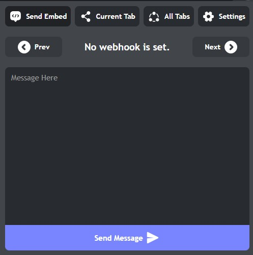
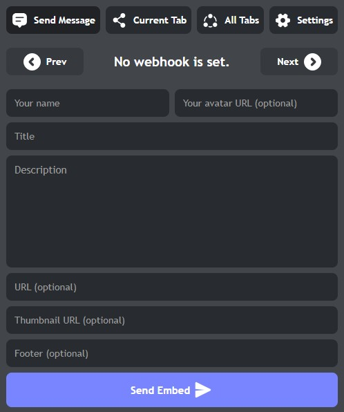
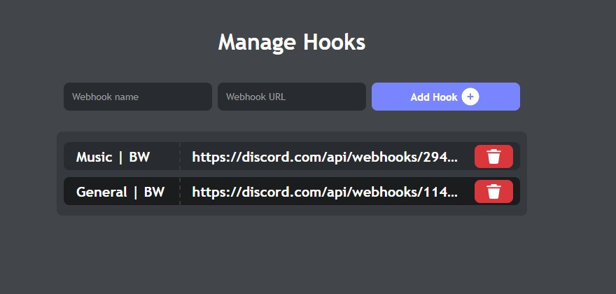
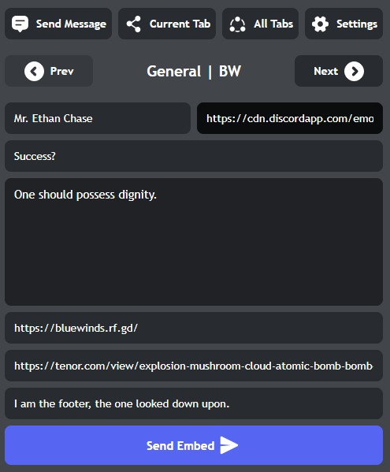
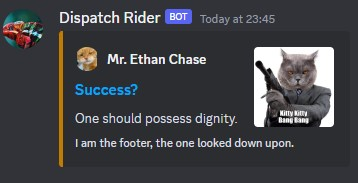

# Dispatch Rider

**Send Discord Messages Directly from Your Browser**

Dispatch Rider is a powerful browser extension designed to streamline communication by enabling users to send messages to Discord channels directly from their browser, eliminating the need to log in or open the Discord app.

## ✨ Changelog

- **Remembers last selected webhook**
- **Added 3 new themes**
- **Refactored codebase**
- **User settings are saved in synced storage**
- **Remembers selected layout type**
- **Fixed settings page flickering**

## Features

- **Effortless Messaging:** Dispatch messages to your Discord channels without the hassle of logging in or launching the Discord application.
- **Seamless Integration:** Stay connected with your community, sharing updates and information without interrupting your browsing experience.
- **User-Friendly:** Dispatch Rider is designed for simplicity and ease of use, ensuring a smooth experience for all users.

## Installation

1. Download the extension files from the repository.
2. Open your browser and navigate to the extension settings.
3. Enable the "Developer mode" option.
4. Click on "Load unpacked" and select the downloaded extension folder.
5. Look for the Dispatch Rider icon, now comfortably resting in your browser toolbar.

## Screenshots

- Sending a message 
   

- Sending an embed 
  

- Managing webhooks 
  

- Example request and response 
  
 
  
  

## Usage

1. Click on the Dispatch Rider icon in your browser toolbar.
2. Craft your message and choose the target Discord channel.
3. Hit "Send" to dispatch your message instantly, bridging the communication gap effortlessly.

## Contribution

Dispatch Rider embraces collaboration. If you're passionate about enhancing this extension, you're welcome to fork this repository and submit your improvements through pull requests.

## Issues

Should you encounter any issues or wish to propose enhancements, kindly initiate a discussion by opening an issue on the GitHub repository.

## License

This project is licensed under the terms of the [MIT License](LICENSE).

## Authors & Contributors

- **Author**: [ShazamBolt8](https://github.com/ShazamBolt8)
- **Contributor**: [Bisskut](https://github.com/0adiy)
- **Contributor**: [Kuroko](https://github.com/leeh-nix)

Your collective efforts have enriched this project with innovation and dedication.
